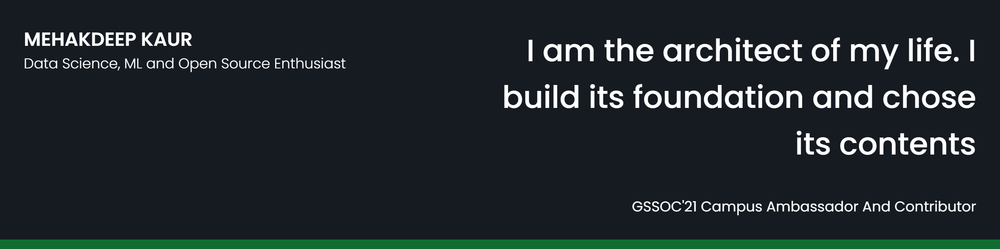

## 🧔 About Me

- 📫 I am a Computer Science and Engineering student, passionate about Data Science, Machine Learning and Quantum Computing. I am also an open source enthusiast.

- 🔭 I’m currently working on [Wine Quality Prediction](https://github.com/mehak6569/Wine-Quality-Prediction)

- 🌱 I’m currently learning **Deep Learning, Tensorflow, Remote Sensing and Android Development**

- 📫 Contact me **[here](mehakdeep6569@gmail.com)**

- 📄 My Resume [Mehakdeep Kaur's Resume](https://drive.google.com/file/d/1dGN9o6eWPozbhHAVOPaRpOZy_cnGiqbg/view?usp=sharing)

## ✍ My Work

## 📚 My Skills

## 🤝 Connect

